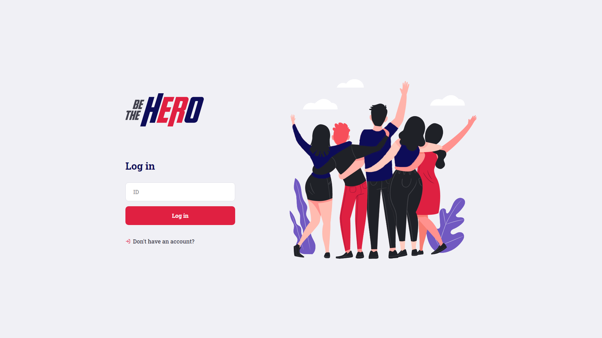

 <h1 align="center">
  </img>
 </h1>

<br>
 
 <p align="center">
  <a href="#page_facing_upresumo-do-projeto">Resumo do projeto</a>&nbsp;&nbsp;&nbsp;|&nbsp;&nbsp;&nbsp;
  <a href="#computertecnologias-e-ferramentas">Tecnologias e Ferramentas</a>&nbsp;&nbsp;&nbsp;|&nbsp;&nbsp;&nbsp;
  <a href="#dvdcomo-rodar-a-aplicação">Como rodar a aplicação</a>&nbsp;&nbsp;&nbsp;|&nbsp;&nbsp;&nbsp;
  <a href="#desktop_computerlayout">Layout</a>&nbsp;&nbsp;&nbsp;|&nbsp;&nbsp;&nbsp;
  <a href="#bookmarkcreditos">Créditos</a>&nbsp;&nbsp;&nbsp;|&nbsp;&nbsp;&nbsp;
 </p>
 
 
 <br>
 
 # :page_facing_up:	Resumo do projeto
 
 O projeto **Be The Hero** visa ajudar animais em perigo, abandonados, feridos ou em qualquer situação prejudicial á eles. A aplicação    consiste em uma ONG que se cadastra e disponibiliza as informações do caso pela **web**, os casos são relacionados aos animais que precisam de ajuda. Á parte **mobile**, é feita para qualquer pessoa interessada em **ajudar** nos casos disponibilizados pelas ONGS.
 
 # :computer:	Tecnologias e Ferramentas
 
  * [Node.js](https://nodejs.org/en/)
  * [ReactJS](https://pt-br.reactjs.org)
  * [ReactNative](https://reactnative.dev)
  * [Insomnia](https://insomnia.rest/download/)
  * [SQLite](https://www.sqlite.org/index.html)
  * [Knex](http://knexjs.org)
  * [Expo](https://expo.io)
 
 # :dvd:	Como rodar a aplicação
 
 Antes de executar a aplicação, vá em cada pasta (**back-end, front-end e mobile**) e execure o comando <br/>
 ``` yarn ``` <br/>
 para instalar todas as dependências.
 
 Após **clonar** o projeto, abra o diretório do onde está salvo o clone em um terminal de sua preferência, até o arquivo **back-end**
 <br/>
 ``` #Execute o  comando ```<br/>
 ```    yarn dev ``` <br/>
 Com o back-end da aplicação rodando, entre no diretório do arquivo **front-end** para execução da parte web
 <br/>
 ``` #Execute o comando ```<br/>
 ``` yarn start ``` <br/>
 Agora com o projeto web rodando, a página será aberta automaticamente e poderá usar o como uma ONG
 Para testar como um usuário "comum", navegue até a pasta **mobile**
 <br/>
 ``` #Execute o comando ```<br/>
 ``` expo start ```<br/>
 Pronto, baixe o **aplicativo expo** na Store de seu smartphone e leia o QRCODE exibido na aba do navegador que o **expo** abriu quando foi executado o comando ou use um emulador.
 
 # :desktop_computer:	Layout
  
  ### Web
 
  </img>
  </img>
  </img>
  </img>
  
  ### Mobile
  
  <br/>
  
   <h3 align="center">
    </img>
    </img>
   </h3>
 
 # :bookmark:	Creditos
 
 O projeto "base" foi desenvolvido na Semana Omnistack 11.0, feita pelo Rocketseat(instr. Diego Fernandes).
